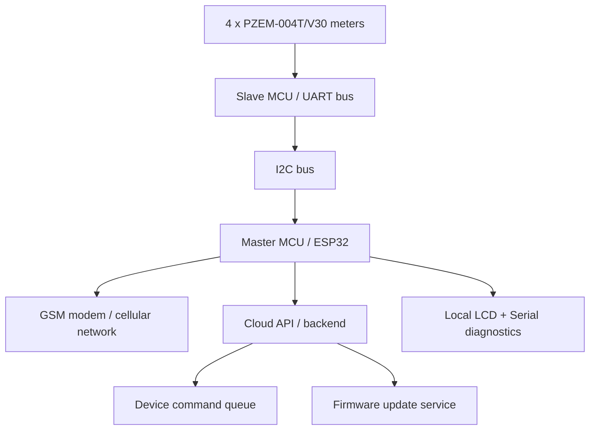

# DTMS Technical Firmware Architecture

## 1. Purpose and Scope

This document describes the firmware architecture for the DTMS (Distribution/Device Telemetry Management System) implemented across the master controller and the slave meter aggregation node. The design targets ESP32-based controller boards with multiple PZEM-004T/V30 energy meters, GSM connectivity, local I2C bus communication, serial diagnostics, and cloud-based firmware and command orchestration.

The architecture is structured around two main firmware roles:

- Master controller: collects power data, handles GSM/cloud communication, polls commands, and orchestrates OTA updates.
- Slave node: reads multiple PZEM meters over a single UART bus and exposes the measured values over I2C to the master.

---

## 2. High-Level System Topology



### Functional viewpoint

- The slave firmware abstracts all low-level PZEM meter polling and meter cache management.
- The master firmware coordinates system health, telemetry upload, command polling, OTA, and user-facing display states.
- The common data model is shared through the include layer to keep sensor reading and metadata definitions unified.

---

## 3. Firmware Layout

```text
ChetrikaRayz/
├── include/
│   ├── data_types.h        # Shared sensor payload structure and safe math helpers
│   ├── device_id.h         # ESP32 device ID generation
│   ├── firmware.h          # Firmware constants, API paths, versioning, server endpoints
│   ├── i2c_master.h        # Master-side I2C behavior and request logic
│   ├── i2c_slave.h         # Slave-side I2C receive/request handlers
│   ├── lcd_display.h       # LCD display logic
│   ├── ota.h               # OTA update orchestration
│   ├── pzem_local.h        # Local PZEM reading helpers
│   ├── pzem_slave.h        # Slave PZEM read cycle and cache management
│   ├── serial_print.h      # Diagnostics formatting
│   ├── simcom_gsm.h        # GSM modem init and HTTP transport
│   ├── swapper_relay.h     # Relay control hooks
│   └── swapper_wifi.h      # Optional connectivity helpers
├── main_master/
│   └── main_master.ino     # Master controller firmware entry point
├── main_slave/
│   └── main_slave.ino      # Slave meter acquisition firmware entry point
├── swapper/
│   └── swapper.ino         # Special-purpose relay/swapper firmware
├── test_server/
│   └── test_server.ino     # Local smoke-test or mock server tooling
├── docs/
│   └── dtms-technical-firmware-architecture.md
└── website/
    └── backend + frontend
```

---

## 4. Shared Platform Model

### 4.1 Common sensor data contract

The foundational shared structure lives in [include/data_types.h](../include/data_types.h). It defines a uniform power-data structure for all phase readings and neutral measurements:

- voltage
- current
- power
- energy
- frequency
- pf

It also defines a helper for rejecting invalid numeric values (
`safeValue()`
), which protects the master and slave software from NaN-driven faults and invalid telemetry bursts.

### 4.2 Firmware and API configuration

The firmware constants are centralized in [include/firmware.h](../include/firmware.h):

- `FW_VERSION`
- `FW_CHANNEL`
- `API_SERVER`
- `DEVICE_API_KEY`
- endpoint paths for telemetry, firmware checks, firmware status, and command retrieval

This allows version-controlled deployment and keeps the device firmware tied to a central backend contract.

### 4.3 Device identity

[include/device_id.h](../include/device_id.h) produces a stable unique identifier from the ESP32 manufacturing MAC address. The solution uses a 12-character hex ID, which is then embedded into telemetry and command requests for server-side device correlation.

---

## 5. Master Firmware Architecture

The master firmware entry point is [main_master/main_master.ino](../main_master/main_master.ino). Its role is to act as the host intelligence layer for the entire DTMS installation.

### 5.1 Core responsibilities

The master firmware is responsible for:

1. Initializing serial, I2C, LCD, and the PZEM bus.
2. Discovering the device identity and loading firmware context.
3. Connecting through GSM modem using `initGSM()`.
4. Reading all meters or consuming slave-derived readings.
5. Formatting power telemetry packets.
6. Uploading telemetry to the backend API.
7. Polling commands from the server.
8. Dispatching command actions such as restart, reset energy, and OTA.
9. Presenting human-readable status on the LCD and serial console.

### 5.2 Master runtime loop

The master loop performs a set of periodic background tasks:

- serial command handling
- meter reads
- telemetry upload
- GSM retry state
- command polling
- heartbeat transmission
- LCD refresh

The timing is intentionally modular and uses millisecond-based intervals, such as:

- `PZEM_READ_INTERVAL_MS`
- `SEND_INTERVAL_MS`
- `COMMAND_INTERVAL_MS`
- `GSM_RETRY_INTERVAL_MS`
- `HEARTBEAT_INTERVAL_MS`

This creates a cooperative state machine rather than a blocking single-threaded flow.

### 5.3 Telemetry generation

The master firmware builds a JSON payload with per-phase measurements for:

- R phase
- Y phase
- B phase
- neutral current

The payload includes:

- device ID
- firmware version
- power values
- current values
- voltage values
- frequency
- power factor
- energy counters after offset adjustment

The cloud-facing payload is transmitted using `httpPost()` to a backend API endpoint defined in the firmware configuration.

### 5.4 Command handling model

The firmware accepts command objects returned by the API and dispatches locally:

- `restart`
- `ota`
- `reset_energy`

This pattern enables remote orchestration without requiring on-site access. OTA commands include URL, target version, and payload size; the firmware then invokes `performOTA()` from the OTA support layer.

### 5.5 GSM/HTTP transport model

The master uses a GSM modem abstraction layer (`include/simcom_gsm.h`) to establish connectivity and issue HTTP requests. Failures trigger a fallback path that sets `gsmReady` to false and schedules another retry after a configured interval.

This is a resilience-oriented design: the device may continue reading local sensors even while the network is degraded, but it suppresses cloud actions until the modem recovers.

### 5.6 LCD and diagnostics

The LCD is used for a compact operational display rather than a full HMI. It cycles between:

- phase voltage/current/power summary
- device status and network health

The serial console supports operator commands such as:

- S: full status dump
- A1..A4: meter address programming
- H: help

This creates a useful service/debugging path during commissioning and maintenance.

---

## 6. Slave Firmware Architecture

The slave firmware is implemented in [main_slave/main_slave.ino](../main_slave/main_slave.ino). Its primary role is to act as one local PZEM bus controller and expose readings to the master over I2C.

### 6.1 Slave design goals

The slave is optimized to:

- read all connected PZEM devices through one UART bus
- maintain a cached reading dataset for each meter
- serve the latest readings over I2C when the master requests them
- expose a simple serial interface for commissioning and diagnosis

### 6.2 Key components

The implementation relies on modules from:

- [include/pzem_slave.h](../include/pzem_slave.h): establishes meter scan/read loop and cached data model
- [include/i2c_slave.h](../include/i2c_slave.h): handles `Wire.onReceive()` and `Wire.onRequest()` callbacks
- [include/serial_print.h](../include/serial_print.h): formats debug output

### 6.3 Multi-meter bus abstraction

The slave firmware treats the bus as a single UART bus carrying several addressed PZEM-004T/V30 devices. The software maintains a meter cache array keyed by slot:

- R phase (0x01)
- Y phase (0x02)
- B phase (0x03)
- neutral (0x04)

The cache is refreshed periodically using a loop that reads and stores sensor state for each meter.

### 6.4 I2C master/slave interaction

The slave acts as an I2C peripheral. It receives requests from the master and responds with the latest cached measurement records. This separation is important because it offloads the time-critical UART meter polling from the master and keeps the master firmware simpler and less fragile.

---

## 7. Inter-Device Communication Model

### 7.1 Master-to-slave

The master uses I2C as a local control and data loop. This is the correct pattern for a multi-meter bus because the slave can continuously poll the UART-attached meters while the master remains focused on GSM and cloud operations.

### 7.2 Slave-to-meters

The slave firmware interacts with the PZEM UART bus with unique addresses, polling each device one by one and updating the internal cache. This avoids the need for a separate MCU per meter and minimizes the wiring footprint.

### 7.3 Master-to-cloud

The master sends aggregated telemetry to the backend over GSM HTTP and receives command payloads from the same API. This provides remote observability and control through a single data plane.

---

## 8. Data Flow Architecture

### 8.1 Normal telemetry flow

```text
PZEM meter(s)
   -> Slave UART polling
   -> local meter cache
   -> I2C read request from master
   -> master aggregation
   -> JSON telemetry payload
   -> GSM HTTP POST
   -> backend API
```

### 8.2 Remote command flow

```text
Backend / cloud
   -> command API payload
   -> GSM HTTP GET / command poll
   -> master JSON parser
   -> command dispatcher
   -> local action (restart / OTA / reset energy)
```

### 8.3 OTA flow

```text
Backend firmware registry
   -> master checks latest firmware
   -> OTA URL + version + size sent via command
   -> OTA module downloads binary
   -> flash update process
   -> restart with new version
```

---

## 9. Software Components by Responsibility

| Layer | Responsibilities | Primary files |
| --- | --- | --- |
| Shared definitions | Sensor schema, device ID, firmware constants | include/data_types.h, include/device_id.h, include/firmware.h |
| Meter abstraction | Local meter reading, validation, conversion | include/pzem_local.h, include/pzem_slave.h |
| Communication | I2C, GSM modem, HTTP, serial diagnostics | include/i2c_master.h, include/i2c_slave.h, include/simcom_gsm.h, include/serial_print.h |
| Display / operator UI | LCD state, serial commands | include/lcd_display.h, main_master/main_master.ino, main_slave/main_slave.ino |
| Control / orchestration | Read loop, telemetry, command dispatch, OTA | main_master/main_master.ino, include/ota.h |
| Special use firmware | Relay/swapper logic | swapper/swapper.ino |

---

## 10. Failure Modes and Recovery Strategy

### 10.1 Meter communication issues

If a PZEM meter is disconnected or returns invalid values:

- `safeValue()` converts NaN to zero
- the master or slave log prints the reading issue
- telemetry may contain a zero or `null` value depending on formatting behavior
- device continues operating instead of crashing

### 10.2 GSM outage

If the modem fails or the network is unreachable:

- the device marks `gsmReady = false`
- the firmware logs the failure
- telemetry upload is skipped until retry interval elapses
- command polling is also paused until the network resumes

### 10.3 OTA failure

If the OTA payload is incomplete or the update fails:

- the firmware keeps the previous image operational until a verified successful update occurs
- server-side command state can be queried again after retry
- local logs capture the version mismatch and failure conditions

### 10.4 Commissioning safety

The `A1..A4` commissioning functions explicitly warn operators to connect only one meter at a time before modifying addresses. This is a critical safety rule because all meters share one UART bus and address collisions would corrupt readings.

---

## 11. Design Strengths

- Clear separation of concerns between meter acquisition, network service, and control logic.
- Cooperative scheduler pattern keeps firmware predictable and easy to debug.
- Centralized shared config prevents duplicate firmware constants and API routes.
- Robust handling of NaN and invalid sensor data avoids unstable runtime behavior.
- Remote command execution supports maintenance without direct physical access.

---

## 12. Operational Notes

### 12.1 Recommended deployment sequence

1. Bring up the slave firmware and validate that each PZEM address is correctly identified.
2. Commission the PZEM addresses (R, Y, B, Neutral) using the serial `A1..A4` commands.
3. Bring up the master firmware and confirm GSM connectivity.
4. Validate telemetry payloads on the backend before enabling a live fleet deployment.
5. Run firmware update checks and confirm OTA fallback behavior in a controlled environment.

### 12.2 Debugging tips

- Use the serial `S` command to dump the full status of slave or master state.
- Watch the LCD for phase values and GSM state.
- Log payloads before HTTP upload to validate field data integrity.
- Keep the energy offset mechanism in mind when reset energy counters after meter calibration.

---

## 13. Summary

The DTMS firmware architecture is a layered, distributed design built around an ESP32 master controller and a slave PZEM aggregation node. The master manages system health, GSM connectivity, cloud telemetry, OTA, and remote commands, while the slave isolates low-level multi-meter bus acquisition and exposes current meter data through I2C.

This structure is scalable, maintenance-friendly, and suitable for a field deployment model in which each site has a single master node, several addressed meters, remote telemetry, and command-driven lifecycle management.
