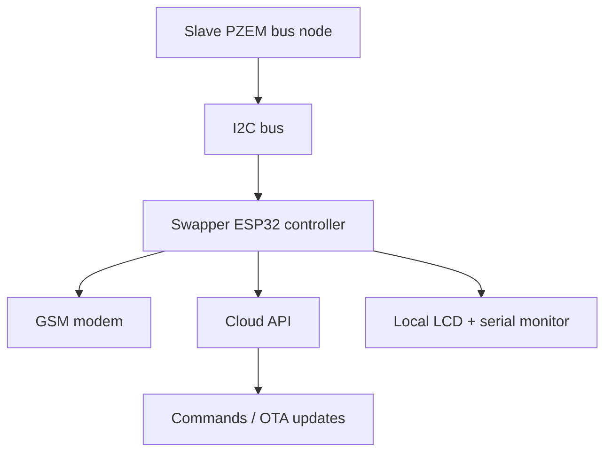

# Swapper Firmware Architecture

## 1. Purpose

The swapper firmware is a specialized DTMS controller for a phase-swapping or relay-controlled site topology. It is built as a GSM-connected ESP32 node that reads four PZEM channels from a local slave device over I2C, formats power telemetry, and communicates with the cloud for heartbeat, command polling, and OTA updates.

Unlike the master meter controller, the swapper firmware is not responsible for direct UART polling of PZEM meters. Instead, it treats the slave node as the source of truth for energy values and focuses on orchestration, display, telemetry upload, and remote control.

---

## 2. High-Level Design



### Core idea

- The slave captures the live PZEM readings over a single UART bus.
- The swapper reads those values over I2C on demand.
- The swapper aggregates and uploads the values to the backend.
- The backend can push configuration commands or firmware updates to the device.

---

## 3. Firmware Layout

```text
ChetrikaRayz/
├── include/
│   ├── data_types.h
│   ├── device_id.h
│   ├── firmware.h
│   ├── i2c_master.h
│   ├── lcd_display.h
│   ├── simcom_gsm.h
│   └── ota.h
├── swapper/
│   └── swapper.ino
├── main_slave/
│   └── main_slave.ino
├── docs/
│   ├── dtms-technical-firmware-architecture.md
│   └── swapper-firmware-architecture.md
└── website/
```

The swapper firmware is intentionally lean and orchestration-focused. It depends on reusable device and network support modules from the shared include directory.

---

## 4. Shared Components Used

### 4.1 Device identity and firmware config

The swapper firmware uses the same shared contracts as the rest of the DTMS stack:

- [include/device_id.h](../include/device_id.h): generates a stable ESP32 identifier from the device MAC.
- [include/firmware.h](../include/firmware.h): holds build version, API server endpoint, API key, and route constants.
- [include/data_types.h](../include/data_types.h): defines the sensor record used for power measurements.

This keeps the swapper compatible with the same backend and device-identification model as the master controller.

### 4.2 GSM and HTTP transport

The modem abstraction layer is reused from the shared include files. The swapper sends:

- telemetry POSTs
- heartbeat packets
- command polls through HTTP GET requests

The `initGSM()` logic and `httpPost()` / `httpGet()` calls are the same operational pattern used in the master controller architecture.

---

## 5. Runtime State Model

The swapper keeps a set of global variables representing the latest meter readings from the slave device:

- `slavePZEM1`
- `slavePZEM2`
- `slavePZEM3`
- `slavePZEM4`

These values are read over I2C and are used to generate telemetry and status displays.

### Energy-reset offset tracking

The firmware tracks stored reset offsets for the first three phases:

- `energyOffset1`
- `energyOffset2`
- `energyOffset3`

This supports the same reset-energy workflow used by the main DTMS devices: after a reset command, the raw energy values are compared against their baseline to produce a clean, resettable energy counter timeline.

---

## 6. Main Functional Flow

### 6.1 Setup phase

During `setup()` the swapper performs the following:

1. Initializes serial communication.
2. Generates the unique device ID.
3. Starts I2C bus communication.
4. Initializes the local LCD.
5. Starts the GSM modem and attempts connectivity.
6. Stores readiness state in `gsmReady`.

The device displays boot status on the LCD and serial output so operators can confirm whether the modem has connected successfully.

### 6.2 Operational loop

The main loop uses millisecond-based scheduling to perform repeated tasks:

- I2C read from the slave node
- LCD refresh
- telemetry upload
- command polling
- heartbeats
- GSM retry logic

This is a cooperative loop and avoids blocking the device on long network operations.

---

## 7. I2C Data Acquisition Pattern

The swapper’s data path is:

```text
Slave reading loop
   -> PZEM data cache
   -> I2C response to master
   -> swapper reads channels 1..4
   -> telemetry formatting
```

The function `getSlavePZEM(slot, target)` is used to fetch the latest values from the local I2C slave. The firmware reads all four channels in a timed loop and stores the values in local structures:

- phase 1
- phase 2
- phase 3
- neutral

This approach keeps the swapper simple and decouples it from low-level meter protocol timing.

---

## 8. Telemetry Architecture

When the device is connected to GSM, the swapper builds a JSON payload with the last known readings from all three active phases and neutral current:

- `v1`, `i1`, `p1`, `e1`, `f1`, `pf1`
- `v2`, `i2`, `p2`, `e2`, `f2`, `pf2`
- `v3`, `i3`, `p3`, `e3`, `f3`, `pf3`
- `i_n`

Each reading is formatted into a compact telemetry string and posted to the backend via `httpPost(API_DATA_PATH, payload, nullptr)`.

The payload also includes:

- `device_id`
- `fw_version`

This makes it compatible with the same backend ingestion model used by the rest of the DTMS fleet.

---

## 9. Command and OTA Model

### 9.1 Polling commands

The swapper periodically calls `pollCommands()`, which performs a GET request to the command endpoint for that device.

If the backend responds with a command payload, the firmware dispatches it using the same remote-control pattern as the master device:

- `restart`
- `ota`
- `reset_energy`

### 9.2 OTA behavior

When it receives an OTA command, the swapper validates:

- firmware URL
- version string
- payload size

Then it calls `performOTA()` to initiate the update flow.

This makes the swapper field-upgradable without a wired maintenance visit.

---

## 10. Heartbeat Strategy

The swapper sends periodic heartbeat packets to the backend with:

- device ID
- firmware version
- network state
- free heap
- uptime

This helps the server monitor health and confirms whether the device remains online after the last telemetry burst.

---

## 11. LCD and Operator Interface

The swapper’s local display is built around a simple status screen. It is intended to summarize the current operational state rather than provide a full system dashboard.

The team can use the LCD to confirm:

- device is online
- GSM is connected
- the system is actively polling the slave node
- the device is ready for remote telemetry

The architecture supports easy extension for phase-level display and alarm states if switch-over logic is later added.

---

## 12. Failure Handling

### 12.1 Slave communication failure

If any `getSlavePZEM()` call fails, the firmware logs a message such as:

- `PZEM1 Read Failed`
- `PZEM2 Read Failed`
- `PZEM4 (Neutral) Read Failed`

This makes it clear that the telemetry is stale or partially missing.

### 12.2 GSM loss

If HTTP fails, the device sets `gsmReady = false` and schedules a retry after the GSM retry interval. While disconnected, it suppresses network operations and waits for a clean reconnect cycle.

### 12.3 Sensor invalid values

The shared `safeValue()` helper ensures that NaN or invalid readings are not propagated to the telemetry payload. This is especially important when a PZEM channel is temporarily unavailable or the slave is still initializing.

---

## 13. Architectural Role in the DTMS System

The swapper is best understood as a remote power orchestration node:

- it is not the low-level meter acquisition engine
- it is a field controller for telemetry, switching logic awareness, and cloud connectivity
- it relies on the slave node for accurate meter values

In a deployment architecture, the swapper sits at the site edge and acts as the secure communication and control point between local power data and the remote backend.

---

## 14. Summary

The swapper firmware follows the same DTMS pattern as the master controller, but with one important difference: it reads its power data from a dedicated local slave device over I2C rather than directly polling the PZEM meters on its own UART bus.

This makes it ideal for a site that separates:

- low-level measurement collection,
- local control and switching logic,
- and cloud-based command and telemetry operations.

It is a clean hybrid architecture with good fault isolation, scalable gateway logic, and strong compatibility with the rest of the DTMS platform.
